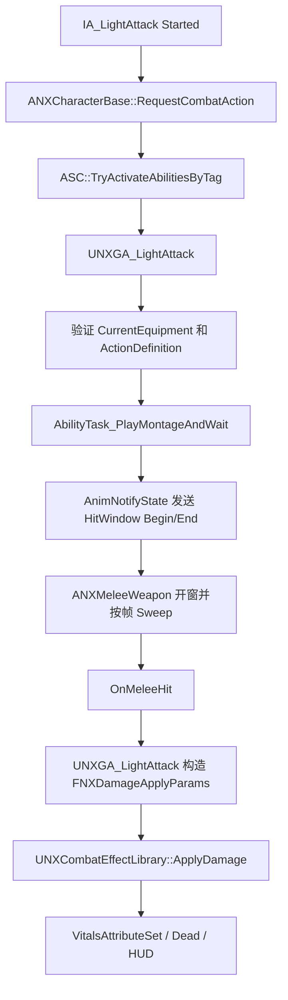

# NexAur 阶段 3：首把近战武器最小闭环（大剑）

> 上层路线图：[混合战斗 GAS 路线图](../../List/hybrid_combat_gas_roadmap.md)
>
> 前置文档：[通用战斗动作与装备契约](../GAS/phase_02_combat_action_equipment_contract.md)、[GAS 属性、伤害与死亡基础](../GAS/gas_vitals_damage_death_foundation.md)
>
> 当前状态：设计初稿待审核；审核通过后先完成 C++ 最小链，再进行编辑器资源接入

## 1. 目标与边界

本阶段只用现有大剑模型和一条轻攻击动画跑通第一条真实近战链：

```text
装备 BP_Greatsword
-> 动态获得 GA_LightAttack
-> RequestCombatAction(Combat.Action.Attack.Light)
-> 播放大剑攻击 Montage
-> AnimNotifyState 打开/关闭命中窗口
-> ANXMeleeWeapon 执行 Sweep 和单窗口去重
-> GA_LightAttack 通过 UNXCombatEffectLibrary 提交 GAS 伤害
-> Health / Dead / HUD 使用现有链路刷新
```

本阶段完成后，必须能够仅替换 DataAsset 和 Montage 来调整第一击，不修改核心 C++。

本阶段不做：

- 不做连击、输入缓存、重攻击、蓄力、格挡、招架和闪避。
- 不扣 Stamina，也不提前加入未使用的 StaminaCost 字段。
- 不做锁定、吸附、攻击转向和 Root Motion 战斗移动。
- 不迁移枪械 Fire/Reload，不复用 `FWeaponShotEvent`。
- 不做近战 VFX、音效、Hit Marker 和 GameplayCue。
- 不新增第二个 Equipment/Combat Component，不改写 GASPALS 插件蓝图。
- 首轮只保证 Standalone 权威链；复制、预测和远端表现留到联机阶段。

## 2. 职责划分

| 对象 | 负责 | 不负责 |
|---|---|---|
| `UNXEquipmentComponent` | 唯一 CurrentEquipment、装备生命周期、装备 Ability 的授予和移除 | 判断轻攻击是否合法、Sweep、伤害 |
| `ANXMeleeWeapon` | 大剑 Mesh、Trace Socket、窗口内 Sweep、同一目标去重 | 输入、Montage、扣血、Stamina |
| `UNXGA_LightAttack` | 激活条件、动作生命周期、Montage、接收命中并提交伤害 | 逐帧几何检测、界面表现 |
| `UNXAnimNotifyState_MeleeHitWindow` | 发送命中窗口 Begin/End Gameplay Event | 直接查询目标、扣血、决定攻击是否成功 |
| `UNXMeleeWeaponDataAsset` | 动作、伤害、Trace 和动画资源的静态配置 | 当前命中集合和运行时状态 |
| `UNXCombatEffectLibrary` | 校验权威和 ASC，通过 GameplayEffect 结算伤害 | Sweep 和动画 |
| 蓝图/AnimBP | Mesh、Socket、Montage、Slot、Overlay 和输入转发 | 保存战斗状态或计算伤害 |

关键规则：**武器发现命中，Ability 决定伤害，GameplayEffect 修改属性。**

## 3. 目标数据流



## 4. C++ 端工作

### 4.1 Native Tags 与近战数据契约

修改：

```text
Source/GASPALS/AbilitySystem/NXGameplayTags.h/.cpp
```

只注册本阶段真实使用的稳定 Tag：

```text
Combat.Action.Attack.Light
Combat.State.Attacking
Combat.Event.HitWindow.Begin
Combat.Event.HitWindow.End
Equipment.Category.Melee
Equipment.Category.Melee.Sword.Greatsword
```

纯资源选择标签 `Animation.Weapon.Sword.Greatsword` 继续放在 `DefaultGameplayTags.ini`，不与 Native Tag 重复注册。

新增：

```text
Source/GASPALS/Combat/Melee/NXMeleeTypes.h
Source/GASPALS/Combat/Melee/NXMeleeWeaponDataAsset.h/.cpp
```

`FNXMeleeActionDefinition` 首轮只保存：

- `ActionTag`
- `CharacterMontage`
- `BaseDamage`
- `MontagePlayRate`
- `BlendOutTime`

`UNXMeleeWeaponDataAsset` 保存：

- `EquipmentAnimationFamily`
- `DefaultAttachSocketName`
- `TraceBaseSocketName`、`TraceTipSocketName`
- `TraceRadius`、`TraceSampleCount`
- `DamageEffectClass`
- `TArray<FNXMeleeActionDefinition> Actions`

DataAsset 提供按 `ActionTag` 精确查找的只读函数，并拒绝无效 Tag、重复 Action 和非法数值。首轮使用硬引用 Montage，暂不为一条动画增加异步加载复杂度。

### 4.2 装备 Ability 生命周期与 Actor 表现策略

修改：

```text
Source/GASPALS/Equipment/NXEquipmentBase.h/.cpp
Source/GASPALS/Equipment/NXEquipmentComponent.h/.cpp
```

在 `ANXEquipmentBase` 增加 `GrantedAbilityClasses` 配置。`UNXEquipmentComponent` 在 Authority 上负责：

1. 装备成功后，以 Equipment Actor 作为 `AbilitySpec.SourceObject` 授予配置的 Ability。
2. 保存本次装备产生的 `FGameplayAbilitySpecHandle`，不把它们放进 PlayerState 的 StartupAbilities。
3. 卸装前先取消仍在执行的装备 Ability，再按 Handle 移除 Spec，最后清理或销毁 Actor。
4. 装备失败、重复装备和 EndPlay 都不能留下失效 Handle。

这样 `GA_LightAttack` 只在大剑装备期间存在，Rifle/Pistol 的能力列表为空，不改变现有枪械链。该功能直接扩展现有 Equipment Component，不新增 Ability 管理组件。

同时增加最小的 Equipment Actor 表现策略：

```text
UseComponentDefault
AttachedVisible
AttachedHidden
```

现有 Rifle/Pistol 继续使用 `UseComponentDefault`；`BP_Greatsword` 使用 `AttachedVisible`，保证 Actor、Mesh 和 Trace Socket 一起跟随手部。若 GASPALS Overlay 必须显示自己的 Mesh，则改用 `AttachedHidden`，但场景中始终只能有一把可见大剑。

### 4.3 近战武器与 Sweep

新增：

```text
Source/GASPALS/Combat/Melee/NXMeleeWeapon.h/.cpp
```

`ANXMeleeWeapon` 继承 `ANXEquipmentBase`，包含 `UStaticMeshComponent` 和 `UNXMeleeWeaponDataAsset`。公开最小运行接口：

```text
PrepareAction(ActionTag)
BeginHitWindow()
EndHitWindow()
ClearPreparedAction()
OnMeleeHit
```

命中窗口打开时记录剑根、剑尖上一帧位置，并仅在窗口期间启用 Tick。每帧在上一帧和当前帧的剑身采样点之间执行 Sphere Sweep：

- `TraceSampleCount` 覆盖整段剑刃，避免只扫剑尖漏掉中段命中。
- 忽略 Owner、武器自身和无效 Actor。
- 使用 `TSet<TWeakObjectPtr<AActor>>` 保证同一窗口内同一 Actor 只广播一次。
- 窗口关闭后立即停止 Tick，并清空上一帧位置与命中集合。
- 几何层只广播 `FHitResult`，不调用 `ApplyDamage()`。
- 伤害 Sweep 只在 Authority 执行；客户端预测表现不产生第二次伤害。

### 4.4 Light Attack Ability 与命中窗口

新增：

```text
Source/GASPALS/AbilitySystem/Abilities/NXGA_LightAttack.h/.cpp
Source/GASPALS/Animation/Notifies/NXAnimNotifyState_MeleeHitWindow.h/.cpp
```

`UNXGA_LightAttack` 使用 `Combat.Action.Attack.Light` 作为 Asset Tag，激活期间持有 `Combat.State.Attacking`。执行顺序：

1. 获取 Avatar 和现有 `UNXEquipmentComponent`，确认 CurrentEquipment 是 `ANXMeleeWeapon`。
2. 确认 Ability 的 SourceObject 与 CurrentEquipment 一致，避免旧装备 Spec 被误激活。
3. 从 DataAsset 查找 Light Attack；先验证 Montage、DamageEffect 和 Trace Socket，再 `CommitAbility()`。
4. 绑定 `OnMeleeHit`，创建 Begin/End Gameplay Event 等待任务，并使用 `PlayMontageAndWait` 播放攻击。
5. Begin Event 调用 `BeginHitWindow()`，End Event 调用 `EndHitWindow()`。
6. 收到 `OnMeleeHit` 后构造 `FNXDamageApplyParams`，通过 `UNXCombatEffectLibrary::ApplyDamage()` 提交伤害。
7. Montage 完成、打断、取消、角色死亡或卸装都进入同一个 `EndAbility()` 清理出口。

`UNXAnimNotifyState_MeleeHitWindow` 只向 Mesh Owner 发送 Begin/End Gameplay Event。Notify 不查找武器、不执行 Sweep、不扣血，因此动画资源可以调整窗口帧而不获得 Gameplay 权威。

死亡时必须取消 `Combat.Action` 下的活动 Ability。实现放在现有 GAS/Vitals 生命周期入口，不在大剑蓝图中临时补 Branch。

## 5. 编辑器与蓝图接入

### 5.1 创建大剑资产

1. 在 `SM_Sword` 上添加 `Trace_Base` 和 `Trace_Tip` Socket，分别放在有效剑刃根部与尖端。
2. 创建 `PDA_Melee_Greatsword`，填写：
   - Animation Family：`Animation.Weapon.Sword.Greatsword`
   - Damage Effect：现有 `GE_Damage_Base`
   - 第一条 Action：`Combat.Action.Attack.Light`
   - 初始伤害建议 `20`，Trace Radius 建议 `6~10 cm`，Sample Count 建议 `4~6`
3. 创建 `BP_Greatsword : ANXMeleeWeapon`，配置 `SM_Sword`、PDA、Equipment Category 和附着策略。
4. 在 `GrantedAbilityClasses` 中只添加 `UNXGA_LightAttack`。

建议路径：

```text
Content/Blueprints/Weapons/BP_Greatsword
Content/Data/Weapons/PDA_Melee_Greatsword
Content/Weapons/BigSword/SM_Sword
```

### 5.2 攻击 Montage、Slot 与 Overlay

1. 从现有 UEFN 大剑动画中只选一条单次斩击；优先检查 `AS_UEFNSword_VerticalSlash_Seq`，不要先使用 Combo Sequence。
2. 首轮使用 In Place 动画；如果动画强依赖 Root Motion，先制作 In Place 派生版本，不在本阶段同时设计战斗移动。
3. 创建 `AM_UEFN_Greatsword_LightAttack`，使用专用全身 Slot `NXCombatFullBody`。
4. 在角色 AnimBP 最终输出前接入 `NXCombatFullBody` Slot。该 Slot 只承载近战动作，不复用枪械 `NXWeaponAction`。
5. 在 Montage 中只覆盖刀刃真正运动的帧添加 `NXAnimNotifyState_MeleeHitWindow`。
6. 为 GASPALS Overlay 增加 Greatsword 持续姿势。Overlay 负责待机/移动，Montage 负责攻击；Overlay 不保存攻击状态。
7. 优先让 `BP_Greatsword` Actor Mesh 成为唯一可见武器，Overlay 的 HeldObject Mesh 留空。若 Overlay 资源强制使用自己的 Mesh，则将 Actor 设为 `AttachedHidden`，并校准两者使用相同附着 Socket 和 Transform。

左手 IK 精修、转身攻击和 Root Motion 统一策略不阻塞本阶段验收。

### 5.3 角色输入与装备测试

角色继续使用现有 `UWeaponComponent`，因为它已经继承 `UNXEquipmentComponent`；不要再挂第二个装备组件。

蓝图只保留两个测试转发：

```text
装备测试键
-> WeaponComponent.EquipEquipment(BP_Greatsword)

IA_LightAttack Started
-> RequestCombatAction(Combat.Action.Attack.Light)
```

蓝图中禁止查找目标、维护 `bIsAttacking`、播放伤害特效或调用 ApplyDamage。装备变化时允许做一次 GASPALS Overlay 映射，因为它属于插件表现适配。

## 6. 清理与失败规则

以下路径都必须最终调用同一套清理函数：

- Montage 正常结束。
- Montage 被其他动作打断。
- Ability Commit 或 Montage 播放失败。
- 角色死亡。
- 大剑卸装、切枪或 Actor EndPlay。
- PIE 结束。

清理结果必须满足：命中窗口关闭、武器 Tick 关闭、命中集合清空、Gameplay Event Task 和 Montage Task 结束、武器委托解绑、`Combat.State.Attacking` 自动移除。

失败动作不得扣血、不得保留攻击状态，也不得触发“攻击成功”表现。

## 7. 验收清单

### 构建与资源

- [ ] UHT、Development Editor 完整编译和链接通过。
- [ ] 新增 C++ 文件出现在 Rider Solution，关键代码有必要的中文注释。
- [ ] `BP_PlayerCharacter`、`BP_Greatsword`、AnimBP、Montage 和 DataAsset 无编译错误。
- [ ] 场景中只有一把可见大剑，Actor Trace Socket 与可见模型一致。

### 装备与 Ability

- [ ] 装备大剑后 CurrentEquipment 指向 `BP_Greatsword`，角色没有第二个 Equipment Component。
- [ ] Light Attack Ability 只在大剑装备期间存在，卸装后 Spec 被移除。
- [ ] 无武器、枪械装备、死亡或重复攻击时请求会被明确拒绝。
- [ ] Montage 完成或中断后 `Combat.State.Attacking` 正确移除。

### 命中与伤害

- [ ] 只有 Notify 窗口内的 Sweep 可以命中。
- [ ] 同一目标在同一窗口只扣一次血，下一次攻击可以再次命中。
- [ ] 剑刃根部、中段和尖端均能命中，低帧率下没有明显穿透漏判。
- [ ] 打空、打墙和 Damage Effect 配置错误不会错误扣血。
- [ ] 伤害通过现有 GAS Vitals 进入 Health、Dead 和 HUD 链。
- [ ] 攻击中死亡、卸装或销毁武器后没有幽灵命中和残留 Tick。

### 回归

- [ ] Rifle/Pistol 装备、射击、换弹、Overlay 和 WeaponStatus 正常。
- [ ] 准心、后坐力、Hit Marker、PlayerStatus 和 GASPALS 移动正常。
- [ ] Output Log 没有重复 Ability、失效委托、无效 Socket 或 Montage 警告。

## 8. 开发顺序与进度

| 顺序 | 工作项 | 状态 |
|---|---|---|
| 3.1 | Native Tags 与近战 DataAsset 契约 | 待开发 |
| 3.2 | Equipment Ability 授予/移除与 Actor 表现策略 | 待开发 |
| 3.3 | ANXMeleeWeapon 与 Sweep | 待开发 |
| 3.4 | GA_LightAttack 与 AnimNotifyState | 待开发 |
| 3.5 | BP_Greatsword、Montage、Slot、Overlay 和输入接入 | 待开发 |
| 3.6 | Standalone 验收、枪械回归与系统文档 | 待测试 |

严格按 `3.1 -> 3.2 -> 3.3 -> 3.4 -> 3.5 -> 3.6` 推进。真实轻攻击完整通过后，再删除 `UNXGA_TestAbility` 和临时 T/Y 测试输入；在此之前保留现有 GAS 冒烟基线。
