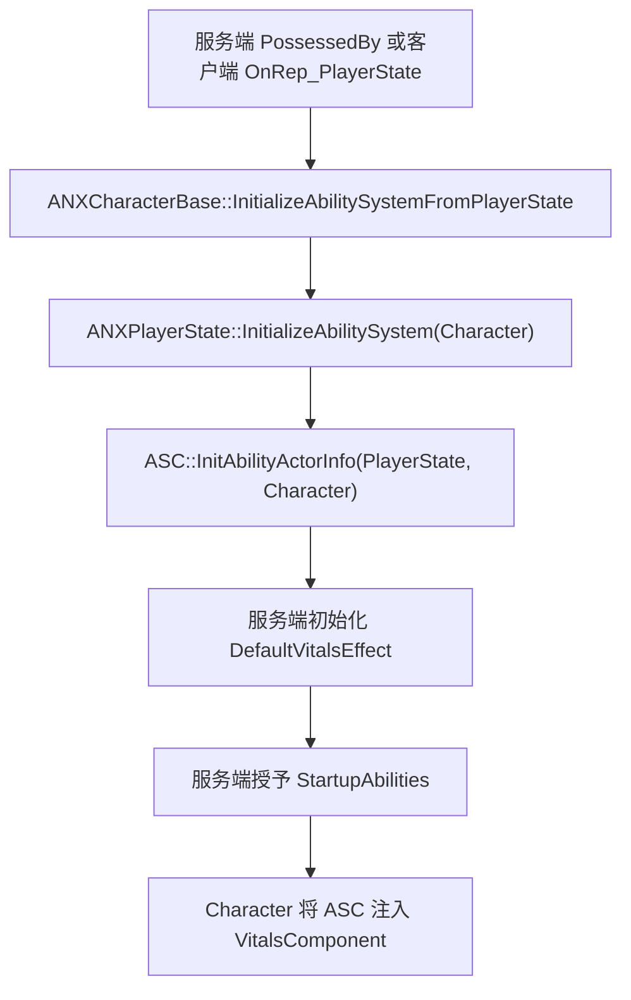

# NexAur GAS 基础运行链

> 文档类型：现行系统复盘，不是待实现方案
>
> 同步日期：2026-07-28

## 1. Owner、Avatar 与数据权威

| 对象 | 运行时职责 |
|---|---|
| `ANXPlayerState` | ASC 的 `OwnerActor`，持有玩家长期 Ability、GameplayEffect 和 `UNXVitalsAttributeSet` |
| `ANXCharacterBase` | ASC 当前的 `AvatarActor`，接收输入、执行动作和承载角色表现 |
| `UAbilitySystemComponent` | Ability Spec、Gameplay Tag 和 Active GameplayEffect 的唯一权威 |
| `UNXVitalsAttributeSet` | Health、MaxHealth、Stamina、MaxStamina 的唯一数值权威 |
| `UNXVitalsComponent` | 观察 ASC 并转换为项目事件，不保存第二份属性 |

核心关系：

```text
OwnerActor  = ANXPlayerState
AvatarActor = 当前 ANXCharacterBase
```

ASC 放在 PlayerState，因此未来销毁旧角色并生成新角色时，只需要更换 Avatar；长期 Ability 和属性不会因为 Pawn 被销毁而重建。

## 2. 初始化调用链



服务端或 Standalone 在 `PossessedBy()` 中初始化。客户端等待 PlayerState 复制完成，在 `OnRep_PlayerState()` 中建立相同的 Owner/Avatar ActorInfo。

`InitializeAbilitySystem()` 可以重复调用，但默认属性和 Startup Ability 都由 PlayerState 内的状态位保护，并且 Ability 授予前还会检查现有 Spec。因此 Avatar 重绑不会重复应用初始属性或重复授予永久 Ability。

## 3. ActionTag 激活与取消

激活链：

```text
输入或 AI
-> ANXCharacterBase::RequestCombatAction(ActionTag)
-> 校验必须是 Combat.Action 的具体子标签
-> TryActivateAbilityByTag(ActionTag)
-> ASC::TryActivateAbilitiesByTag()
-> 匹配 Asset Tag 的 GameplayAbility
```

取消链：

```text
输入释放或系统中断
-> ANXCharacterBase::CancelAbilitiesByTag(ActionTag)
-> ASC::CancelAbilities()
-> GameplayAbility::EndAbility()
-> ActivationOwnedTags 自动移除
```

当前 `UNXGA_TestAbility` 使用 `Combat.Action.Test` 作为 Asset Tag，激活期间持有 `Combat.State.TestAbilityActive`。它只用于 GAS 冒烟测试，将在 `GA_LightAttack` 完成同等验证后清理。

## 4. Vitals 观察链

```text
GameplayEffect 修改 Attribute
-> UNXVitalsAttributeSet
-> ASC Attribute Change Delegate
-> UNXVitalsComponent
-> OnHealthChanged / OnStaminaChanged / OnDeath
-> Gameplay、HUD 和表现监听者
```

`UNXVitalsComponent` 只在 ASC 的 Avatar 等于组件 Owner 时绑定。`UnPossessed()`、`EndPlay()` 或重新初始化前都会解除旧委托，避免旧 Pawn 在重新 Possess 后继续接收属性变化。

## 5. 服务端与客户端边界

- 默认属性初始化和 `GiveAbility()` 只允许 Authority 执行。
- 客户端负责在 PlayerState 到达后恢复 ActorInfo，不自行授予 Ability。
- ASC 使用 Mixed Replication Mode；拥有者接收完整 GAS 信息，其他客户端接收必要状态。
- 当前已通过 Standalone 调用链验证；两玩家 Listen Server、预测修正和重生重绑保留到联机阶段专项验收。

## 6. 关键代码入口

```text
Source/GASPALS/Player/NXPlayerState.h/.cpp
  InitializeAbilitySystem / InitializeDefaultAttributes / GrantStartupAbilities

Source/GASPALS/Character/NXCharacterBase.h/.cpp
  PossessedBy / OnRep_PlayerState / RequestCombatAction / CancelAbilitiesByTag

Source/GASPALS/AbilitySystem/Abilities/NXGA_TestAbility.h/.cpp
  Asset Tag / ActivationOwnedTags / ActivateAbility / EndAbility

Source/GASPALS/AbilitySystem/Vitals/NXVitalsComponent.h/.cpp
  InitializeWithAbilitySystem / UninitializeFromAbilitySystem
```

排查时首先确认日志中的 Owner 是 PlayerState、Avatar 是当前 Character，并检查同一 Ability Class 是否始终只有一个 Spec。
