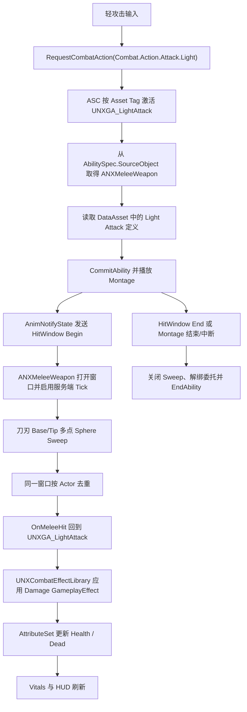

# 近战轻攻击运行调用链

> 当前范围：Nodachi 单次轻攻击、Standalone 权威命中、GAS 伤害。连击、精力消耗、联机预测和 GameplayCue 尚未接入。

## 1. 核心职责

| 层 | 当前对象 | 职责 |
|---|---|---|
| 输入与 Avatar | `ANXCharacterBase` / `BP_PlayerCharacter` | 将输入转换为 `Combat.Action.Attack.Light` 请求，不直接播放动画或检测碰撞 |
| ASC Owner | `ANXPlayerState` | 持有 ASC、AttributeSet 和 Ability Spec |
| 装备管理 | `UNXEquipmentComponent` / `UWeaponComponent` | 维护唯一 `CurrentEquipment`，装备时授予 Ability，卸装时取消并移除 |
| 近战武器 | `ANXMeleeWeapon` | 持有 Static Mesh、动作数据、Trace Socket 和命中窗口 Sweep |
| 数据资产 | `UNXMeleeWeaponDataAsset` | 按 Action Tag 配置 Montage、伤害、Sweep 半径和播放参数 |
| 动作生命周期 | `UNXGA_LightAttack` | 校验上下文、提交 Ability、播放 Montage、监听窗口事件并应用 GAS 伤害 |
| 动画窗口 | `UNXAnimNotifyState_MeleeHitWindow` | 在刀刃有效帧发送 Hit Window Begin/End Gameplay Event |
| 属性与 UI | GAS Vitals / 原生 HUD Widget | 接收伤害结果并刷新 Health、Dead 和 PlayerStatus |

## 2. 装备链

```text
角色请求 EquipEquipment(BP_Notachi_Melee)
-> UNXEquipmentComponent 生成并设置 CurrentEquipment
-> ANXMeleeWeapon::NotifyEquipped
-> 根据 GrantedAbilityClasses 向 PlayerState ASC 授予 UNXGA_LightAttack
-> AbilitySpec.SourceObject = 当前 ANXMeleeWeapon
-> 角色根据 EquipmentAnimationFamily 更新 Nodachi Overlay
```

装备期 Ability 使用精确 `FGameplayAbilitySpecHandle` 记录。切装、卸装、死亡或组件 EndPlay 时，组件先取消正在执行的 Ability，再移除 Spec，最后清理和销毁装备 Actor。

## 3. 攻击与命中链



## 4. 关键约束

- `Combat.State.Attacking` 由 Ability 的 `ActivationOwnedTags` 持有，`EndAbility` 后自动移除。
- 同一目标只在当前 Hit Window 内去重；下一次攻击可以再次命中。
- 客户端可以播放动画，但 Standalone 阶段只有 Authority 执行 Gameplay Sweep 和伤害。
- Overlay 只提供持续持刀姿势；`NXCombatFullBody` Slot Montage 负责攻击动作。
- Rifle/Pistol 继续走 `ANXRangedWeapon` 和枪械表现链，不共享近战 Sweep 数据。
- `nx.Melee.DrawDebugTrace 1` 可显示命中采样，验收后使用 `0` 关闭。

## 5. 当前验收结果

2026-08-11 已通过：

- 空手、Rifle、Pistol、Nodachi 装备、卸装和快速切换。
- 单目标去重、多目标命中、打空与下一次攻击重新命中。
- 攻击中切装、卸装、死亡和 Montage 中断清理。
- Nodachi Root Motion 无结束回弹。
- Rifle/Pistol ADS、射击、换弹、完整枪械表现与 HUD 回归。
- Health、Stamina、准心、WeaponStatus、PlayerStatus 与基础移动回归。

## 6. 后续工作

1. 清理阶段 1 的 `UNXGA_TestAbility`、测试 Tags 和临时输入。
2. 将资产名 `BP_Notachi_Melee` 统一为 `BP_Nodachi_Melee` 并修复 Redirectors。
3. 设计连击、输入缓存、Stamina Cost、重攻击与格挡。
4. 在基础链保持稳定后，再为 Nodachi 扩展专用 Pose Search Database。
