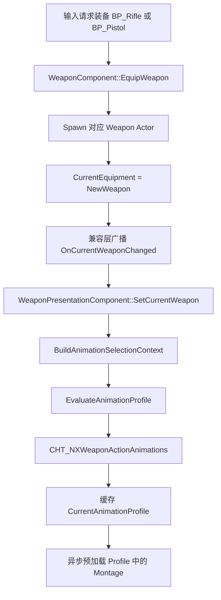
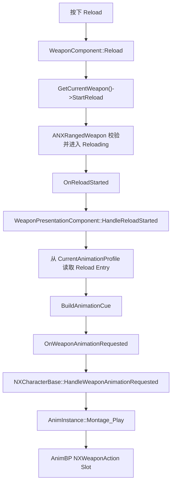

# 武器动画数据调用链
> 当前范围：UEFN 角色骨架、第三人称、Reload 动画。Fire、Equip、Unequip 后续继续使用同一条链路扩展。

## 1. 核心结论

系统不会在 C++ 中判断“当前是不是步枪”。运行时传递的是当前武器 Actor，表现组件从该 Actor 的 `WeaponDataAsset` 读取动画族标签，再由 Chooser Table 选择 Animation Profile。

```text
BP_Rifle  -> DA_Rifle  -> Animation.Weapon.Rifle
BP_Pistol -> DA_Pistol -> Animation.Weapon.Pistol

角色动画族 + 武器动画族 + 视角模式
-> CHT_NXWeaponActionAnimations
-> 对应的 UWeaponAnimationProfile
-> Reload Montage 和播放策略
```

因此，增加新武器类型时通常只增加标签、Profile 和 Chooser 行，不需要在 C++ 中增加武器类型分支。

## 2. 各层职责

| 层 | 当前对象 | 职责 |
|---|---|---|
| 武器 Actor | `BP_Rifle`、`BP_Pistol` | 持有自己的 `WeaponDataAsset`，维护弹药和换弹状态 |
| Gameplay 数据 | `DA_Rifle`、`DA_Pistol` | 保存 `ReloadTime`、弹药参数和 `WeaponAnimationFamily` |
| 角色数据 | `BP_PlayerCharacter` | 保存 `CharacterAnimationFamily` |
| 路由表 | `CHT_NXWeaponActionAnimations` | 根据 Context 选择 Profile |
| 动画数据 | `PDA_Anim_UEFN_Rifle/Pistol` | 保存 Montage、TimingPolicy、BlendOutTime 和 RetriggerPolicy |
| 表现解析 | `UWeaponPresentationComponent` | 缓存 Profile，把 Gameplay 事件转换为 `FWeaponAnimationCue` |
| 动画执行 | `ANXCharacterBase` | 验证 Cue，并调用 `AnimInstance` 播放或停止 Montage |
| 姿势混合 | `ABP_SandboxCharacter` | 通过 `NXWeaponAction` Slot 和骨骼遮罩输出最终角色姿势 |

## 3. 当前资产配置

```text
BP_PlayerCharacter.CharacterAnimationFamily
  = Animation.Character.UEFN

DA_Rifle.WeaponAnimationFamily
  = Animation.Weapon.Rifle

DA_Pistol.WeaponAnimationFamily
  = Animation.Weapon.Pistol

CHT_NXWeaponActionAnimations
  UEFN + Rifle + ThirdPerson -> PDA_Anim_UEFN_Rifle
  UEFN + Pistol + ThirdPerson -> PDA_Anim_UEFN_Pistol

PDA_Anim_UEFN_Rifle.Reload.CharacterMontage
  = AM_UEFN_m4a1_reload1

PDA_Anim_UEFN_Pistol.Reload.CharacterMontage
  = AM_UEFN_pistol_aim_reload_Montage
```

两个 Reload Entry 当前均使用：

```text
TimingPolicy   = FitGameplayDuration
RetriggerPolicy = IgnoreIfPlaying
BlendOutTime   = 0.15
```

## 4. 装备时的 Profile 解析链



### 4.1 WeaponComponent 传递什么

`UWeaponComponent::EquipWeapon()` 调用通用装备流程；实际 Actor 指针只保存在基类的 `CurrentEquipment` 中：

```text
Source/GASPALS/Weapons/WeaponComponent.cpp

EquipEquipment(WeaponClass)
-> UNXEquipmentComponent::SpawnEquipment()
-> CurrentEquipment = NewWeapon
-> UWeaponComponent::HandleCurrentEquipmentChanged()
-> OnCurrentWeaponChanged
```

`GetCurrentWeapon()` 只把 `CurrentEquipment` 转型为 `ANXRangedWeapon*`，不保存第二份可写武器状态。兼容事件中传递的是 `ANXRangedWeapon* NewWeapon`，不是 Rifle/Pistol 枚举。

### 4.2 表现组件如何知道武器类型

`UWeaponPresentationComponent::BuildAnimationSelectionContext()` 读取：

```text
CharacterAnimationFamily
  <- ANXCharacterBase::GetCharacterAnimationFamily()

WeaponAnimationFamily
  <- CurrentWeapon
  <- CurrentWeapon->GetWeaponData()
  <- WeaponData->WeaponAnimationFamily

ViewMode
  <- WeaponPresentationComponent.AnimationViewMode
```

UE 5.8 的 Chooser `Gameplay Tag` 列只绑定 `FGameplayTagContainer`。角色和武器资产仍保存单个 `FGameplayTag`，构造 Context 时再包装成只含一个标签的容器。

### 4.3 Chooser 何时执行

Chooser 只在以下情况重新解析：

- 装备或切换武器。
- 当前武器的 `WeaponData` 改变。
- 角色的 `CharacterAnimationFamily` 改变。
- `AnimationViewMode` 改变。
- 手动调用 `RefreshAnimationProfile()`。

开火和换弹热路径只读取缓存的 `CurrentAnimationProfile`，不会每发射击重新查询 Chooser。

## 5. 换弹时的 Montage 执行链



### 5.1 Gameplay 先决定换弹是否合法

`ANXRangedWeapon::StartReload()` 先检查弹药、弹匣和当前状态。只有 Gameplay 真正进入换弹状态后才广播 `OnReloadStarted`。

动画层不能自行决定补弹，也不能因为 Montage 缺失阻止 Gameplay。

### 5.2 Profile 生成不可变 Cue

`BuildAnimationCue()` 从当前 Profile 的 Reload Entry 复制：

```text
CueType
SourceWeapon
Montage
StartSection
PlayRate
BlendOutTime
RetriggerPolicy
ActionId
```

`FitGameplayDuration` 的播放率计算为：

```text
PlayRate = MontageLength / WeaponData.ReloadTime
```

因此：

- Animation Profile 决定播放哪段动画和采用什么表现策略。
- 当前武器的 DataAsset 决定 Gameplay 换弹需要多长时间。

### 5.3 角色执行器

`ANXCharacterBase` 收到 Cue 后先验证：

```text
PresentationComponent 仍是当前组件
SourceWeapon 仍是当前武器
ActionId 仍是当前动作
```

随后执行：

```text
Fire / ReloadStarted / Equipped -> Montage_Play
ReloadCanceled                  -> 停止对应 Montage
ReloadFinished                  -> 让 Montage 自然结束
Unequipped                      -> 停止本执行器启动的武器 Montage
```

`Montage_Play(..., bStopAllMontages=false)` 不会直接停止 GASPALS 的其他 Montage Group。

## 6. Reload 完成与取消

`ReloadStarted` 时，表现组件保存本次 `FWeaponAnimationCue` 和 `ActionId`。

```text
正常完成
-> ReloadFinished 使用同一个 ActionId
-> Gameplay 已经结算弹药
-> Montage 自然收尾

中途切枪或取消
-> ReloadCanceled 使用同一个 ActionId 和 Montage
-> 按 BlendOutTime 停止
-> 不补弹
```

保存 Started 时的 Cue 可以避免异步 Profile 更新后，取消事件错误停止另一套 Montage。

## 7. Fallback 顺序

当前解析顺序为：

```text
Chooser 精确匹配的 Animation Profile
-> DefaultAnimationProfile
-> WeaponDataAsset 旧 Fire/Reload/Equip Montage 字段
-> 空 Montage，安全跳过表现
```

当前 `BP_PlayerCharacter.DefaultAnimationProfile` 已清空。这样 Chooser 缺少映射时不会错误播放 Rifle Profile，配置问题会更明显。

## 8. 排查顺序

PIE 中选择运行时角色的 `WeaponPresentationComp`，依次检查：

```text
CurrentAnimationContext.CharacterAnimationFamily
CurrentAnimationContext.WeaponAnimationFamily
CurrentAnimationContext.ViewMode
CurrentAnimationProfile
AnimationProfileReady
```

常见情况：

| 现象 | 优先检查 |
|---|---|
| Profile 为 `None` | Chooser 是否已绑定、Context 标签、Chooser 行和列绑定 |
| Pistol 一直得到 Rifle Profile | `DA_Pistol.WeaponAnimationFamily`、Default Profile 是否残留 |
| Profile 正确但动画错误 | Profile 的 Reload Montage 引用、Montage Slot |
| Profile 正确但没有动画 | `AnimationProfileReady`、Montage 是否有效、Slot 是否进入最终 AnimGraph |
| 动画播放但姿势不对 | `NXWeaponAction` Slot、Layered Blend 骨骼起点、Hand IK 曲线 |
| 换弹时间不一致 | `WeaponData.ReloadTime`、Montage Length、TimingPolicy |

## 9. 增加新武器的最小流程

以 Shotgun 为例：

1. 添加 `Animation.Weapon.Shotgun` Gameplay Tag。
2. 设置 `DA_Shotgun.WeaponAnimationFamily`。
3. 创建 `PDA_Anim_UEFN_Shotgun` 并填写动作资源。
4. 在 Chooser 增加 `UEFN + Shotgun + ThirdPerson` 行。
5. 装备后检查 `CurrentAnimationProfile`。

不需要修改 `WeaponPresentationComponent`，也不需要在角色蓝图中增加 Shotgun 分支。

## 10. 主要代码入口

```text
Source/GASPALS/Weapons/WeaponComponent.cpp
  EquipWeapon / GetCurrentWeapon / HandleCurrentEquipmentChanged

Source/GASPALS/Equipment/NXEquipmentComponent.cpp
  EquipEquipment / CurrentEquipment / BroadcastCurrentEquipmentChanged

Source/GASPALS/Weapons/NXRangedWeapon.cpp
  StartReload / FinishReload / CancelReload

Source/GASPALS/Weapons/WeaponPresentationComponent.cpp
  SetCurrentWeapon
  BuildAnimationSelectionContext
  ResolveAnimationProfile / EvaluateAnimationProfile
  HandleReloadStarted
  BuildAnimationCue / TryApplyAnimationProfile

Source/GASPALS/Weapons/WeaponAnimationTypes.h
  FWeaponAnimationSelectionContext
  FWeaponAnimationEntry
  FWeaponAnimationCue

Source/GASPALS/Character/NXCharacterBase.cpp
  HandleWeaponAnimationRequested
  PlayWeaponAnimationCue / StopWeaponAnimationCue
```

更完整的开发计划与待办见：`Docs/05_tasks/weapon/动画表现.md`。
